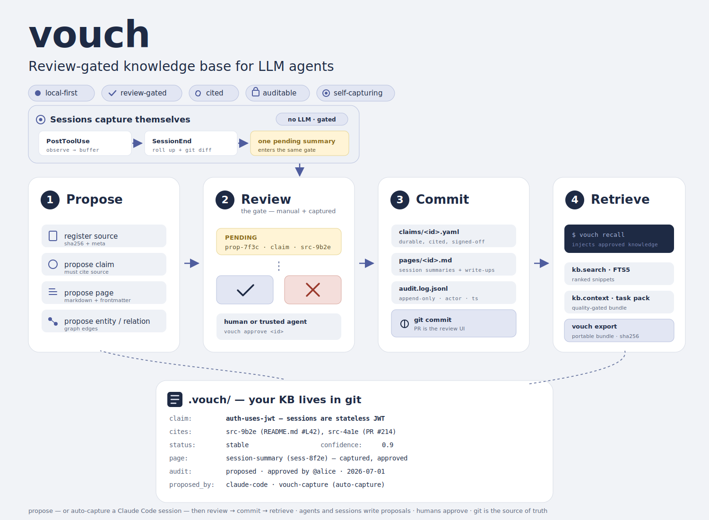

# vouch

**Git-native, review-gated knowledge base for LLM agents. MCP server + JSONL tool server + CLI.**

<p align="center">
  
</p>

<p align="center">
  <a href="https://github.com/vouchdev/vouch/actions/workflows/ci.yml"></a>
  <a href="https://pypi.org/project/vouch-kb/"></a>
  <a href="https://pypi.org/project/vouch-kb/"></a>
  <a href="LICENSE"></a>
  <a href="https://x.com/vouch_dev"></a>
  <a href="https://gittensor.io/miners/repository?name=vouchdev/vouch"></a>
</p>

> Agents should not start every session with amnesia — but they shouldn't get to write whatever they want either.

`vouch` gives LLM agents durable memory with an explicit **review gate**: sessions capture themselves, agents *propose* writes, and nothing becomes durable knowledge until you approve it. Approved artifacts are plain files under `.vouch/` — YAML claims, markdown pages — so the KB lives in your repo, is reviewed like code, diffs cleanly, and travels with `git clone`.

The destination is the one [Andrej Karpathy's llm-wiki idea file](https://gist.github.com/karpathy/442a6bf555914893e9891c11519de94f) sketches: stop using LLMs as search engines that rediscover your documents on every question — use them as tireless knowledge engineers that compile, cross-reference, and maintain a living wiki, while humans curate and think. vouch is that idea with the write path made trustworthy. `vouch compile` has an LLM draft the topic pages, but every page cites approved claims, every `[claim: …]` citation is machine-verified before the draft is filed, and the drafts pass through the same review gate as every other write. The LLM compiles; the human approves; the wiki compounds.

## Watch it work (110 seconds)

[](docs/vouch-how-it-works.mp4)

**capture → summarize → approve → compile → recall.** Captured live from the review console, no mockups — the preview above is muted and 3× speed; the full cut is **[▶ docs/vouch-how-it-works.mp4](docs/vouch-how-it-works.mp4)**. A Claude Code session captures itself, an LLM summarizes what the session *meant*, a human approves it at the gate, **`vouch compile`** distills the approved claims into cited topic pages (every `[claim: …]` citation machine-verified, still gated), and the film closes on real `vouch recall` output — the wiki the video just built, injected into the next session's first turn.

Everything below exists to reproduce that loop on your own project.

## Install

```bash
# one-liner (Linux + macOS) — picks a Python, ensures pipx, installs vouch-kb
curl -fsSL https://raw.githubusercontent.com/vouchdev/vouch/main/install.sh | sh

# …or directly via pipx (vouch-kb on PyPI; the command stays `vouch`)
pipx install vouch-kb
```

The one-liner is POSIX `sh` and never needs `sudo` — inspect [`install.sh`](install.sh) first if you'd like. Prefer containers? The released image runs the same CLI and MCP server ([`ghcr.io/vouchdev/vouch`](https://github.com/vouchdev/vouch/pkgs/container/vouch)):

```bash
docker run -i --rm -v "$PWD:/data" ghcr.io/vouchdev/vouch:latest          # stdio MCP server
docker run --rm -v "$PWD:/data" ghcr.io/vouchdev/vouch:latest status      # any CLI command
```

## Reproduce the loop on your project

**1. Set up the KB and wire Claude Code** (one-time, per repo):

```bash
cd /path/to/your/project
vouch init
vouch install-mcp claude-code
```

`init` creates `.vouch/` with a starter config; `install-mcp` writes `.mcp.json` (the `kb.*` MCP tools), the `/vouch-*` slash commands, and three hooks — `PostToolUse` capture, `SessionEnd` rollup, `SessionStart` recall. Restart Claude Code so they load.

**2. Point `compile` at an LLM** — the only step that needs a model. In `.vouch/config.yaml`:

```yaml
compile:
  llm_cmd: "claude -p --model sonnet"
```

**3. Work a session — it captures itself.** Use Claude Code normally. Each tool call is harvested into a gitignored scratch buffer, and at session end the buffer rolls up — mechanically, no LLM — into **one pending session-summary page**. Never auto-approved: the next session greets you with

```text
🔔 1 auto-captured session summary(ies) awaiting review — run `vouch review`.
```

**4. Approve at the gate.**

```bash
vouch review                    # walk pending proposals one at a time
```

The browser console in the video is the **[vouch webapp](https://github.com/vouchdev/webApp)** — chat, review, pending queue, claims, and stats over a running KB. Connect it in two commands:

```bash
vouch serve --transport http    # serves the kb.* surface on 127.0.0.1:8731
# then, in a clone of the vouch webapp:
npm install && npm run dev      # opens http://localhost:5173 — point the
                                # connect dialog at http://127.0.0.1:8731
```

Lighter alternatives ship with vouch itself: `vouch review-ui` (a built-in browser queue; `pipx install 'vouch-kb[web]'` for the extra), or piecemeal `vouch pending`, `vouch show <id>`, `vouch approve <id>`, `vouch reject <id> --reason "…"`.

**5. Compile the wiki.**

```bash
vouch compile                   # LLM drafts cited topic pages from approved claims
vouch review                    # drafts land in the same gate — approve the keepers
```

Every `[claim: …]` marker and `[[wikilink]]` in a draft is verified mechanically against the store; drafts whose citations don't hold are dropped before they reach you. See [docs/compile.md](docs/compile.md).

**6. Start the next session — it already knows.** The `SessionStart` hook runs `vouch recall`, injecting every approved claim and page title into the first turn, so the session starts from your reviewed knowledge instead of re-discovering it.

Detection is Claude Code's hook contract: whatever a `SessionStart` hook prints becomes context in the session's opening turn. `vouch recall` prints the digest the video closes on — claims with their full text, pages by id and title:

```text
<vouch-approved-knowledge>
# approved KB knowledge for this repo — 2 claim(s), 1 page(s). reviewed,
# cited, durable. use kb_read_page / kb_search for detail; kb_propose_*
# (human-approved) to add more.

## claims
- [auth-uses-jwt] Auth uses JWT tokens — decision from the design note.
- [vouch-starter-reviewed-knowledge] Vouch stores reviewed, cited knowledge
  in the repository so future agent sessions can retrieve agreed project
  context.

## pages
- [edit-in-obsidian] Edit in Obsidian
</vouch-approved-knowledge>
```

Only approved artifacts are ever emitted — archived, superseded, and still-pending items are excluded — and the digest is size-guarded (`recall.max_chars`) with an explicit truncation notice.

How the approved pages actually get used from there: recall carries the *titles*, and the session pulls full content on demand through the `kb.*` MCP tools — `kb_search` matches page bodies, `kb_read_page` returns a page's markdown plus the claims it cites, and `kb_context` bundles the most relevant claims and pages for a stated task. To pull a topic in explicitly, use the `/vouch-recall <topic>` slash command, or just ask Claude to check the KB. One thing to know: pages still sitting in `vouch review` are invisible to all of this — the gate applies to retrieval too, so a compiled page only starts informing sessions once you approve it.

**7. Commit the knowledge with the code.**

```bash
git add .vouch/ && git commit -m "kb: approve session summary"
```

Pending drafts (`proposed/`) and the derived search index (`state.db`) are gitignored — what lands in history is exactly what passed review.

## The rules underneath

* **Writes require approval.** Agents file *proposals* via the `kb.*` MCP tools (or `vouch serve --transport jsonl`); approval is the only path to a durable artifact, and the approver must differ from the proposer unless you opt out.
* **Claims must cite sources.** A claim without evidence is a validation error, not a warning. Sources are content-hashed; the same evidence registered twice de-duplicates.
* **History is append-only.** Every mutation lands in a committed audit log — who proposed, who approved, citing what, when.

## Going further

* [docs/example-session.md](docs/example-session.md) — the full capture→approve→recall walkthrough with real output
* [docs/getting-started.md](docs/getting-started.md) — the agent-side flow
* [SPEC.md](SPEC.md) — the protocol contract (object model, JSONL envelopes, trust metadata)
* `vouch --help` / `vouch capabilities` — the full CLI and machine-readable method surface
* `vouch install-mcp <host>` also wires cursor, codex, zed, windsurf, openclaw and friends ([adapters/](adapters/))
* [vouch webapp](https://github.com/vouchdev/webApp) — the chat-first browser console from the video; [vouch-desktop](https://github.com/vouchdev/vouch-desktop) wraps the same loop as a desktop app
* [CONTRIBUTING.md](CONTRIBUTING.md) — development setup and the test gate

## License

MIT.
