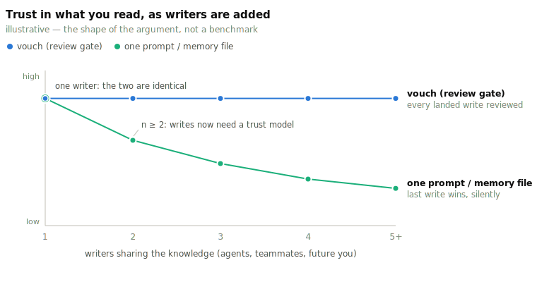

# vouch

**Git-native, review-gated knowledge base for LLM agents. MCP server + JSONL tool server + CLI.**

<!-- mcp-name: io.github.vouchdev/vouch -->
<!-- the mcp registry verifies package ownership by matching this marker against
     server.json's `name`; keep it in lockstep with server.json at the repo root. -->

<p align="center">
  <a href="https://github.com/vouchdev/vouch/actions/workflows/ci.yml"></a>
  <a href="https://pypi.org/project/vouch-kb/"></a>
  <a href="https://github.com/mcp/vouchdev/vouch"></a>
  <a href="https://pypi.org/project/vouch-kb/"></a>
  <a href="LICENSE"></a>
  <a href="https://gittensor.io/miners/repository?name=vouchdev/vouch"></a>
</p>

> Agents should not start every session with amnesia — but they shouldn't get to write whatever they want either.

`vouch` gives LLM agents durable memory with an explicit **review gate**: sessions capture themselves, agents *propose* writes, and nothing becomes durable knowledge until you approve it. Approved artifacts are plain files under `.vouch/` — YAML claims, markdown pages — so the KB lives in your repo, is reviewed like code, diffs cleanly, and travels with `git clone`.

The destination is the one [Andrej Karpathy's llm-wiki idea file](https://gist.github.com/karpathy/442a6bf555914893e9891c11519de94f) sketches: stop using LLMs as search engines that rediscover your documents on every question — use them as tireless knowledge engineers that compile, cross-reference, and maintain a living wiki, while humans curate and think. vouch is that idea with the write path made trustworthy. `vouch compile` has an LLM draft the topic pages, but every page cites approved claims, every `[claim: …]` citation is machine-verified before the draft is filed, and the drafts pass through the same review gate as every other write. The LLM compiles; the human approves; the wiki compounds.

## "I can do this with one prompt"

Often true — and worth being honest about. If you want your agent to remember things, a paragraph in `CLAUDE.md`, a memory file, or your host's built-in auto-memory gets you most of the way, costs nothing, and needs no install. Reach for that first. Recall is not a hard problem.

What is hard is *trust in the write path*, and that's a different problem than memory. Single-writer memory needs no trust model: you're the only author, and a bad line costs you a shrug. The moment writes come from **more than one author** — several agents, a teammate, a future you who forgot the context — the question stops being "what did we say?" and becomes "**who decided this was true, on what evidence, and can I audit it later?**" A prompt cannot answer that, no matter how good the prompt is.

That's the whole of vouch:

| | one prompt / memory file | vouch |
|---|---|---|
| **Who can write** | whatever the agent decides to save | agents *propose*; a human approves — nothing else lands |
| **Why believe a line** | vibes | every claim cites a content-hashed source; uncited is a validation error |
| **When it's wrong** | edit and hope | supersede / contradict / archive, with the old version still in history |
| **Who changed it** | file mtime | append-only audit log: who proposed, who approved, citing what, when |
| **At n ≥ 2 writers** | last write wins, silently | one gate, one reviewed history, shared by `git clone` |
| **What you read** | a growing pile of notes | compiled topic pages with verified citations — a wiki, not a log |

The same argument as a picture — at one writer the two are the same thing; the gap opens at the second writer and only widens:

<picture>
  <source media="(prefers-color-scheme: dark)" srcset="docs/img/trust-vs-writers-dark.svg">
  
</picture>

So the honest pitch: **vouch is not a better place to put memory — it's a review gate in front of one, and a wiki on the other side of it.** If you're solo and happy, one prompt is genuinely fine; vouch's session capture runs passively alongside whatever your host already remembers, rather than replacing it. But once a fleet of agents writes to shared knowledge — or a team does — that pile of notes needs an editor, and an editor is not something you can prompt your way to. The case in full: [docs/review-gate.md](docs/review-gate.md).

## Watch it work (110 seconds)

[](docs/vouch-how-it-works.mp4)

**capture → summarize → approve → compile → recall.** Captured live from the review console, no mockups — the preview above is muted and 3× speed; the full cut is **[▶ docs/vouch-how-it-works.mp4](docs/vouch-how-it-works.mp4)**. A Claude Code session captures itself, an LLM summarizes what the session *meant*, a human approves it at the gate, **`vouch compile`** distills the approved claims into cited topic pages (every `[claim: …]` citation machine-verified, still gated), and the film closes on real `vouch recall` output — the wiki the video just built, injected into the next session's first turn.

Everything below exists to reproduce that loop on your own project.

## Install

**For the full UI experience** (recommended first time):

```bash
docker run --rm -p 127.0.0.1:5173:5173 -v vouch-demo-data:/data ghcr.io/plind-junior/vouch-demo
# then open http://localhost:5173
```

Pre-seeded KB + full webapp console, zero setup. Pass `-e ANTHROPIC_API_KEY=sk-ant-...` to enable LLM features.

**For the full UI without Docker** — Python only, no clone, no node:

```bash
pipx install 'vouch-kb[web]'                  # the browser console ships inside the wheel
vouch serve --transport http --port 8731 &    # a backend for the current .vouch/
vouch console                                 # console at http://localhost:5173 — connect it to :8731
```

`vouch console` serves the same React console as the Docker demo, straight from the installed package.

**For CLI + Claude Code integration** (most common ongoing workflow):

```bash
# one-liner (Linux + macOS) — picks a Python, ensures pipx, installs vouch-kb
curl -fsSL https://raw.githubusercontent.com/vouchdev/vouch/main/install.sh | sh

# …or directly via pipx (vouch-kb on PyPI; the command stays `vouch`)
pipx install vouch-kb
```

The one-liner is POSIX `sh` and never needs `sudo` — inspect [`install.sh`](install.sh) first if you'd like.

**For MCP server or CLI-only use**:

```bash
docker run -i --rm -v "$PWD:/data" ghcr.io/vouchdev/vouch:latest          # stdio MCP server
docker run --rm -v "$PWD:/data" ghcr.io/vouchdev/vouch:latest status      # any CLI command
```

**For local development** — CLI and webapp, both running from source:

```bash
git clone https://github.com/vouchdev/vouch
cd vouch
python3 -m venv .venv && source .venv/bin/activate
pip install -e '.[dev,web]'    # dev,web is what CI installs — make check needs both
vouch --version                # the CLI now runs straight from src/ — edits apply without reinstalling

make console                   # webapp in dev mode: vouch backend on :8731 + live-reload
                               # console at http://localhost:5173 — Ctrl-C stops both

make check                     # the CI gate: lint + type + test
```

`make console` needs node — it starts `vouch serve --transport http` and the Vite dev server as a pair, installing the console's node deps automatically on first run. To instead serve the console the way a release wheel does (no dev server), run `make webapp-build` once, then `vouch console`. See [CONTRIBUTING.md](CONTRIBUTING.md) for the full dev workflow.

## Reproduce the loop on your project

After exploring the demo above, set up vouch in your own project:

**1. Set up the KB and wire Claude Code** (one-time, per repo):

```bash
cd /path/to/your/project
vouch init                          # creates .vouch/ with starter config
vouch install-mcp claude-code       # wires capture hooks into Claude Code
```

`install-mcp` writes `.mcp.json` (the `kb.*` MCP tools), the `/vouch-*` slash commands, and three hooks — `PostToolUse` capture, `SessionEnd` rollup, `SessionStart` recall. Restart Claude Code so they load.

**2. Point `compile` at an LLM** — the only step that needs a model. In `.vouch/config.yaml`:

```yaml
compile:
  llm_cmd: "claude -p --model sonnet"
```

**3. Work a session — it captures itself.** Use Claude Code normally. Each tool call is harvested into a gitignored scratch buffer, and at session end the buffer rolls up — mechanically, no LLM — into **one pending session-summary page**. Never auto-approved: the next session greets you with

```text
🔔 1 auto-captured session summary(ies) awaiting review — run `vouch review`.
```

**4. Approve at the gate.**

```bash
vouch review                    # walk pending proposals one at a time
```

**Want a browser UI for reviewing and proposing?** The video shows the **vouch webapp** — chat, review queue, claims, and stats. You have four options:

- **No setup**: Use the Docker demo (recommended)
- **pip, no clone**: `pipx install 'vouch-kb[web]'` then `vouch console` — serves the same React console from the installed package (Python only, no Docker, no node), open http://localhost:5173
- **Local development**: Clone the repo, run `make console`, open http://localhost:5173
- **CLI-only**: Use `vouch review`, `vouch show <id>`, `vouch approve <id>` commands instead

**Point the webapp at your existing KB:**

```bash
# Terminal 1: start the vouch server pointing at your .vouch/
cd /path/to/your/project
vouch serve --transport http --port 8731

# Terminal 2: run the Docker UI pointing at that server
docker run --rm -p 127.0.0.1:5173:5173 \
  -e VOUCH_TARGET=http://host.docker.internal:8731 \
  ghcr.io/plind-junior/vouch-demo
# then open http://localhost:5173
```

Or serve that same console with no Docker — `vouch console` in place of Terminal 2 (needs the `[web]` extra), then add the `:8731` backend in the connect dialog:

```bash
vouch console                   # http://localhost:5173, proxying to the server above
```

Or to skip the browser entirely and use the CLI tools:

```bash
vouch review                    # walk pending proposals
vouch show <id>                 # inspect a claim or page
vouch approve <id>              # approve a proposal
vouch reject <id> --reason "…"  # reject with feedback
```

Both browser UIs ship with vouch under the `[web]` extra (`pipx install 'vouch-kb[web]'`): `vouch console` is the full React console shown in the video; `vouch review-ui` is a lighter built-in review queue. Or go piecemeal: `vouch pending`, `vouch show <id>`, `vouch approve <id>`, `vouch reject <id> --reason "…"`.

**5. Compile the wiki.**

```bash
vouch compile                   # LLM drafts cited topic pages from approved claims
vouch review                    # drafts land in the same gate — approve the keepers
```

Every `[claim: …]` marker and `[[wikilink]]` in a draft is verified mechanically against the store; drafts whose citations don't hold are dropped before they reach you. See [docs/compile.md](docs/compile.md).

**6. Start the next session — it already knows.** The `SessionStart` hook runs `vouch recall`, injecting every approved claim and page title into the first turn, so the session starts from your reviewed knowledge instead of re-discovering it.

Detection is Claude Code's hook contract: whatever a `SessionStart` hook prints becomes context in the session's opening turn. `vouch recall` prints the digest the video closes on — claims with their full text, pages by id and title:

```text
<vouch-approved-knowledge>
# approved KB knowledge for this repo — 2 claim(s), 1 page(s). reviewed,
# cited, durable. use kb_read_page / kb_search for detail; kb_propose_*
# (human-approved) to add more.

## claims
- [auth-uses-jwt] Auth uses JWT tokens — decision from the design note.
- [vouch-starter-reviewed-knowledge] Vouch stores reviewed, cited knowledge
  in the repository so future agent sessions can retrieve agreed project
  context.

## pages
- [edit-in-obsidian] Edit in Obsidian
</vouch-approved-knowledge>
```

Only approved artifacts are ever emitted — archived, superseded, and still-pending items are excluded — and the digest is size-guarded (`recall.max_chars`) with an explicit truncation notice.

How the approved pages actually get used from there: recall carries the *titles*, and the session pulls full content on demand through the `kb.*` MCP tools — `kb_search` matches page bodies, `kb_read_page` returns a page's markdown plus the claims it cites, and `kb_context` bundles the most relevant claims and pages for a stated task. To pull a topic in explicitly, use the `/vouch-recall <topic>` slash command, or just ask Claude to check the KB. One thing to know: pages still sitting in `vouch review` are invisible to all of this — the gate applies to retrieval too, so a compiled page only starts informing sessions once you approve it.

**7. Commit the knowledge with the code.**

```bash
git add .vouch/ && git commit -m "kb: approve session summary"
```

Pending drafts (`proposed/`) and the derived search index (`state.db`) are gitignored — what lands in history is exactly what passed review.

## The rules underneath

* **Writes require approval.** Agents file *proposals* via the `kb.*` MCP tools (or `vouch serve --transport jsonl`); approval is the only path to a durable artifact, and the approver must differ from the proposer unless you opt out.
* **Claims must cite sources.** A claim without evidence is a validation error, not a warning. Sources are content-hashed; the same evidence registered twice de-duplicates.
* **History is append-only.** Every mutation lands in a committed audit log — who proposed, who approved, citing what, when.

## Going further

* [docs/example-session.md](docs/example-session.md) — the full capture→approve→recall walkthrough with real output
* [docs/getting-started.md](docs/getting-started.md) — the agent-side flow
* [SPEC.md](SPEC.md) — the protocol contract (object model, JSONL envelopes, trust metadata)
* `vouch --help` / `vouch capabilities` — the full CLI and machine-readable method surface
* `vouch install-mcp <host>` also wires cursor, codex, zed, windsurf, openclaw and friends ([adapters/](adapters/))
* [vouch webapp](https://github.com/vouchdev/webApp) — the chat-first browser console from the video; [vouch-desktop](https://github.com/vouchdev/vouch-desktop) wraps the same loop as a desktop app
* [CONTRIBUTING.md](CONTRIBUTING.md) — development setup and the test gate

## Incubated by Gittensor

Vouch was incubated and supported by [Gittensor](https://gittensor.io), a protocol that rewards open-source contributions. The knowledge-base-as-code pattern and review-gated persistence model emerged directly from conversations about trusted AI agents and long-term memory in collaborative development workflows.

## License

MIT.
