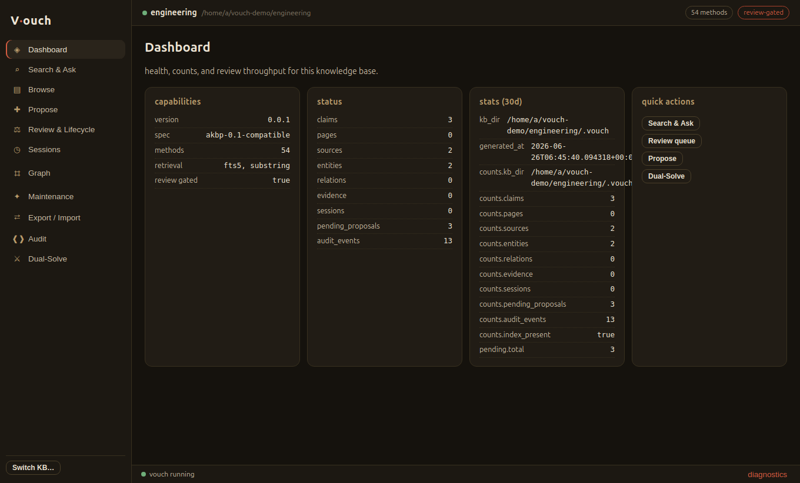
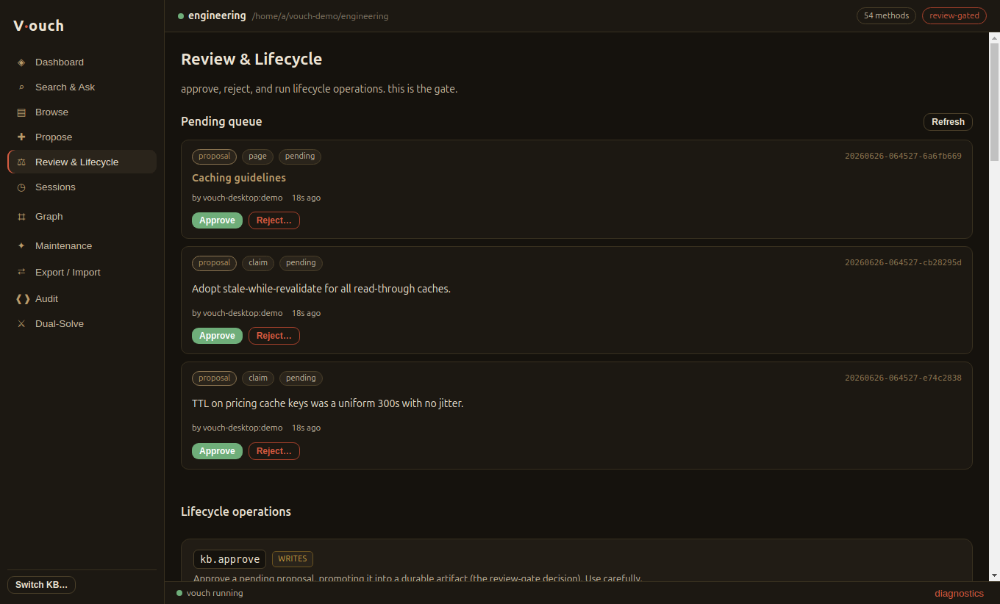
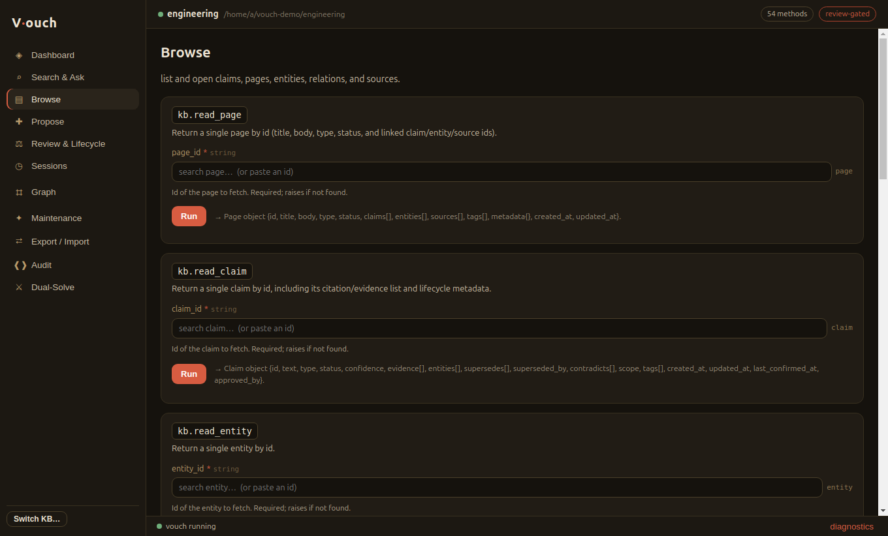
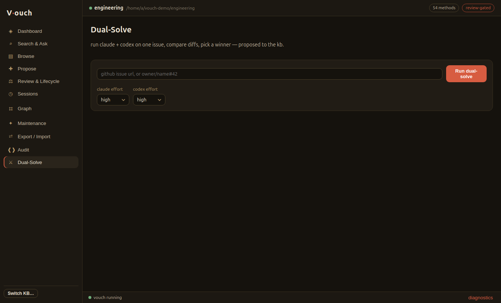

# vouch-desktop

A cross-platform **Electron** desktop app that puts a GUI on the entire
[vouch](https://github.com/vouchdev/vouch) command surface — the review-gated,
local-first decision-memory knowledge base.



vouch is an **unmodified dependency**: vouch-desktop spawns the `vouch` CLI's
machine transports and never patches its Python source. It talks to vouch two
ways, and never writes durable KB state except through vouch's own
**propose → approve** review gate.

- **JSONL stdio** (`vouch serve --transport jsonl`) — the workhorse. All 54
  `kb.*` methods (read, search, list, propose, review, lifecycle, sessions,
  graph, maintenance, export/import, audit) flow over one newline-delimited
  JSON pipe.
- **HTTP + WebSocket** (`vouch review-ui --allow-dual-solve`) — spawned lazily,
  only when you open the Dual-Solve view, for the one thing JSONL can't do:
  the long-running, sandboxed two-engine dual-solve runner with streamed
  progress.

## What you get

- **One window over every command.** A left-rail of ten task-shaped views plus a
  bespoke Dual-Solve runner. Data-entry methods get forms **generated** from a
  verified parameter catalog (typed controls, enum dropdowns, sliders, tag
  inputs, native file pickers, and search-backed id typeaheads) — so the UI
  stays in step with vouch instead of hand-coding 54 forms.
- **The gate, made visible.** Propose anything; it lands in the review queue.
  Approve / reject from the Review view. Nothing is ever auto-approved.
- **Capability-aware.** Methods the connected vouch doesn't advertise are shown
  disabled, and light up automatically when you upgrade vouch.
- **A companion, not just a window.** Tray icon with a pending-count badge and KB
  switcher, native notifications (a dual-solve run is ready to judge; new
  proposals arrived; the process went down), and no terminal required — the app
  finds, launches, and supervises vouch for you.

## A look around

| The gate, made visible | Forms from the catalog |
|---|---|
| [](docs/screenshots/review.png) | [](docs/screenshots/browse.png) |
| Propose anything and it lands in the **review queue**. Approve or reject it here — nothing is ever auto-approved. | Every method gets a typed form **generated** from the verified parameter catalog, with id typeaheads and result cards. |

The bespoke **Dual-Solve** runner is the one thing JSONL can't do — it drives
vouch's sandboxed two-engine runner over HTTP, streams progress, then proposes
the winning diff into the same review queue:

[](docs/screenshots/dual-solve.png)

## Requirements

- **Node 18+** and **npm** to build/run from source (Node 20+ recommended).
- **vouch** on your `PATH` (`pipx install vouch`), or set its path in the app.
  Dual-solve additionally needs vouch's `[web]` extra (`pipx install
  'vouch[web]'`), `git` / `gh` / `docker` on `PATH`, the `vouch/coder:latest`
  sandbox image, and the KB inside a git repository.

## Quick start

From the monorepo root, enter the desktop package first:

```bash
cd desktop
npm install
npm start
```

On first launch, **Open existing…** a folder containing a `.vouch/` directory,
or **Initialize new…** to create one. The app spawns and supervises the vouch
process; you never touch a shell.

## Tech stack

React 18 + TypeScript 5 renderer, built with **electron-vite** (three-target
build: main → CJS, preload → CJS, renderer → React/ESM). Vitest 2 +
`@testing-library/react` for unit tests. Typed IPC contract shared between main,
preload, and renderer via `src/shared/ipc.ts`; typed parameter catalog in
`src/shared/methods.gen.ts` (generated from `src/catalog/methods.json`).

## Develop

```bash
npm run dev           # electron-vite dev — launches Electron with HMR
npm run dev:vouch     # dev mode pinned to ../.venv/bin/vouch; restarts on Python changes
npm run build         # electron-vite build → out/main, out/preload, out/renderer
npm test              # vitest run — catalog, gen-methods, form, controls (85 tests)
npm run typecheck     # tsc -b --noEmit across main + preload + renderer
npm run gen:methods   # regenerate src/shared/methods.gen.ts from src/catalog/methods.json
npm run dist          # electron-vite build + electron-builder → dmg / nsis / AppImage
```

From the monorepo root, the same validation gate is available as
`make desktop-check`.

For Python + desktop development from the monorepo root, use the universal
dev-loop command:

```bash
make desktop-dev-vouch KB=/path/to/repo-with-.vouch
```

It runs `electron-vite dev`, refreshes the editable vouch install when needed,
sets `VOUCH_DESKTOP_VOUCH_PATH` to the root `.venv/bin/vouch`, opens the
optional `KB=` path, and restarts Electron whenever vouch's Python sources or
schema/template files change. Once a KB is open, the desktop app starts vouch as
`.venv/bin/vouch serve --transport jsonl`, so the next restart picks up Python
code changes cleanly.

`src/catalog/methods.json` is the verified surface catalog (method names,
parameters, types, enum sets) extracted from vouch's source. `scripts/gen-methods.ts`
enriches it and writes `src/shared/methods.gen.ts`, which drives the form
generator. Regenerate it when vouch's surface changes.

To ship a zero-Python install, freeze vouch with PyInstaller into
`resources/vouch/` (see `scripts/freeze-vouch.sh`); the locator prefers it.

## Architecture

```
 renderer (sandboxed, no node)
   │  window.vouch.call(method, params)   ← one frozen preload bridge
   ▼  IPC
 main process
   ├─ JsonlClient   → vouch serve --transport jsonl   (all 54 kb.* methods)
   ├─ HttpClient    → vouch review-ui --allow-dual-solve --dual-solve-sandbox
   ├─ Supervisor    → health poll, restart, shutdown
   ├─ Tray/Notifier → companion + OS notifications
   └─ KbStore       → recent KBs, prefs
```

See [`docs/architecture.md`](./docs/architecture.md) for the full design,
including the method-by-method coverage table.

## Status

v0.1.0 covers the entire `kb.*` surface plus dual-solve. The CLI-only
orchestration commands (`auto-pr`, `migrate`, `schema`, `sync-*`) are not yet
surfaced — see the [CHANGELOG](./CHANGELOG.md).

## License

MIT.
