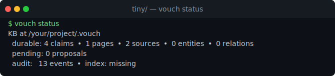
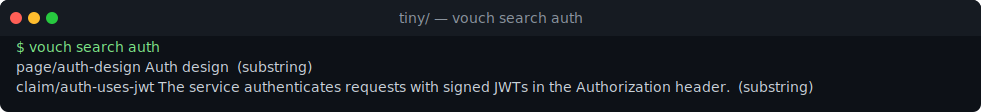
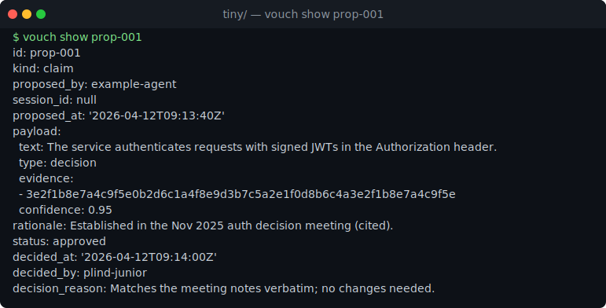
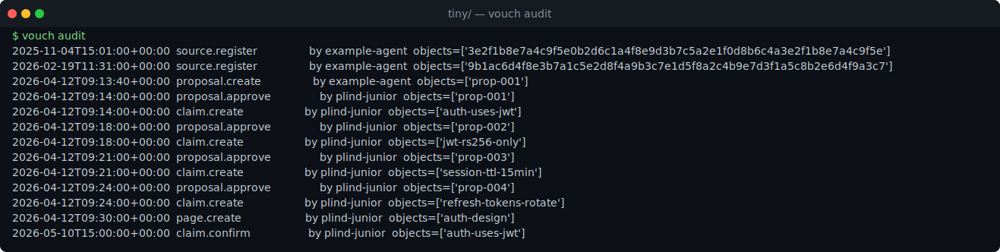

# tiny/

A four-claim KB about a hypothetical auth design. The whole point of
this example is to show that a vouch KB is **just files** — you can
read them, you can grep them, you can review them in a PR.

```
vouch/
├── config.yaml
├── audit.log.jsonl
├── claims/
│   ├── auth-uses-jwt.yaml
│   ├── jwt-rs256-only.yaml
│   ├── session-ttl-15min.yaml
│   └── refresh-tokens-rotate.yaml
├── pages/
│   └── auth-design.md
├── sources/
│   ├── 3e2f.../meta.yaml
│   └── 9b1a.../meta.yaml
└── decided/
    ├── prop-001.yaml
    ├── prop-002.yaml
    ├── prop-003.yaml
    └── prop-004.yaml
```

(The source ids are abbreviated in this README; on disk they're full
64-char sha256 hashes.)

## What to look at first

1. [vouch/claims/auth-uses-jwt.yaml](vouch/claims/auth-uses-jwt.yaml) —
   the canonical shape of a Claim. Note the `evidence` array; that's
   the citation that makes this claim non-fabrication-able.
2. [vouch/pages/auth-design.md](vouch/pages/auth-design.md) — a Page is
   markdown with YAML frontmatter, referencing claims by id.
3. [vouch/decided/prop-001.yaml](vouch/decided/prop-001.yaml) — what an
   approved proposal looks like after `vouch approve`.
4. [vouch/audit.log.jsonl](vouch/audit.log.jsonl) — the audit trail.
   Every mutation is one line. Open it in a text editor.

## See it in action

After `cp -r examples/tiny/vouch ./.vouch`, here's what the CLI shows against
this fixture. (Images are rendered from the fixture by
[`docs/img/examples/render.py`](../../docs/img/examples/render.py).)

`vouch status` — artifact counts and the audit-event total:



`vouch search auth` — substring retrieval across claims and pages:



`vouch show prop-001` — the approved proposal behind `auth-uses-jwt`, with its
rationale, cited evidence, and `decision_reason`:



`vouch audit` — the authoritative gate sequence, every mutation attributed:



## What this example is *not*

- It's not a teaching example for the entire object model. It only
  uses Claims, Pages, and Sources. Entities and Relations would
  exercise the graph side; that example is on the to-do list.
- It's not pre-loaded with `proposed/` items. Proposals are gitignored
  in real KBs, so an example with pending proposals would be a lie.
